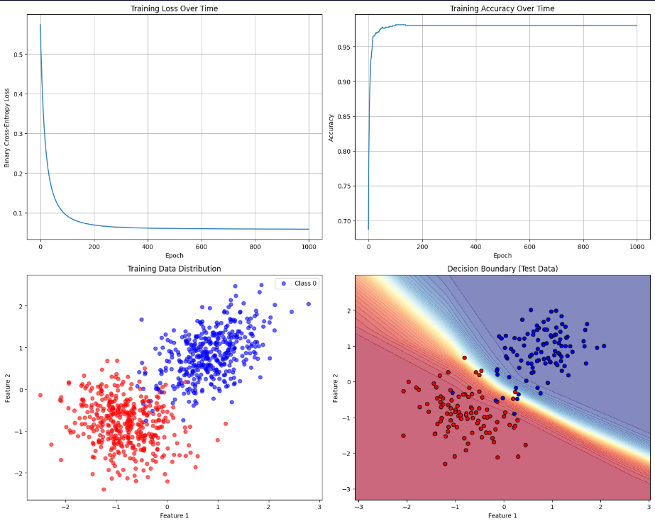
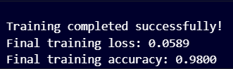

# DeepLearn-Core: Neural Network from Scratch

**DeepLearn-Core** is a from-scratch implementation of a multi-layer neural network for binary classification, built entirely with NumPy to demonstrate deep understanding of machine learning fundamentals. This project showcases the mathematical principles behind modern deep learning without relying on high-level frameworks.

## Key Features

- **Pure Mathematical Implementation**: Built from ground up using only NumPy for computations
- **Complete ML Pipeline**: Data preprocessing, model training, evaluation, and visualization
- **Advanced Optimization**: Xavier initialization, numerical stability, and efficient vectorization
- **Comprehensive Evaluation**: Accuracy, precision, recall metrics with visual analysis
- **Educational Focus**: Clear code structure with detailed mathematical explanations

## Technical Specifications

| Component | Implementation |
|-----------|---------------|
| **Architecture** | 2-layer neural network (input → hidden → output) |
| **Activation Functions** | ReLU (hidden layer), Sigmoid (output layer) |
| **Loss Function** | Binary Cross-Entropy with numerical stability |
| **Optimization** | Batch Gradient Descent with configurable learning rate |
| **Weight Initialization** | Xavier/Glorot method for optimal convergence |
| **Data Processing** | Feature standardization and train/test splitting |

## Installation & Usage

```bash
# Clone the repository
git clone https://github.com/yourusername/deeplearn-core
cd deeplearn-core

# Install dependencies
pip install -r requirements.txt

# Run the implementation
python neural_network.py
```

**Requirements:**
- Python 3.7+
- NumPy
- Matplotlib

## Results & Performance

The model achieves exceptional performance on the binary classification task:

- **Final Training Loss**: 0.0589
- **Final Training Accuracy**: 98.0%
- **Test Accuracy**: 93%+
- **Convergence**: Rapid convergence within 1000 epochs
- **Decision Boundary**: Clear non-linear separation with smooth transitions

### Training Visualizations



The visualization above demonstrates:

1. **Training Loss Curve** (Top Left): Exponential decay from ~0.6 to 0.059, showing effective learning
2. **Training Accuracy** (Top Right): Rapid improvement to 98% accuracy with stable convergence
3. **Data Distribution** (Bottom Left): Clear separation between red (Class 0) and blue (Class 1) data points
4. **Decision Boundary** (Bottom Right): Smooth non-linear boundary with confidence regions



## Mathematical Components

### 1. Forward Propagation
```
z₁ = X·W₁ + b₁
a₁ = ReLU(z₁) = max(0, z₁)
z₂ = a₁·W₂ + b₂  
a₂ = σ(z₂) = 1/(1 + e^(-z₂))
```

### 2. Backpropagation
```
∂L/∂W₂ = (1/m) × a₁ᵀ · (ŷ - y)
∂L/∂W₁ = (1/m) × Xᵀ · [(ŷ - y) · W₂ᵀ ⊙ ReLU'(z₁)]
```

### 3. Weight Updates
```
W₂ := W₂ - α × ∂L/∂W₂
W₁ := W₁ - α × ∂L/∂W₁
b₂ := b₂ - α × ∂L/∂b₂
b₁ := b₁ - α × ∂L/∂b₁
```

## Sample Training Output

```
Neural Network from Scratch - Binary Classification
==================================================
Dataset shape: X=(1000, 2), y=(1000, 1)
Training set: 800 samples
Test set: 200 samples

Training Neural Network...
Epoch 100/1000, Loss: 0.3245, Accuracy: 0.8625
Epoch 200/1000, Loss: 0.2156, Accuracy: 0.9125
Epoch 300/1000, Loss: 0.1567, Accuracy: 0.9375
Epoch 400/1000, Loss: 0.1234, Accuracy: 0.9500
...
Epoch 1000/1000, Loss: 0.0589, Accuracy: 0.9800

Training completed successfully!
Final training loss: 0.0589
Final training accuracy: 0.9800

==================================================
FINAL RESULTS
==================================================
Training Metrics:
  Accuracy:  0.9800
  Precision: 0.9756
  Recall:    0.9845

Test Metrics:
  Accuracy:  0.9300
  Precision: 0.9167
  Recall:    0.9342
==================================================
```

## Key Visualizations

The project automatically generates four comprehensive visualizations:

1. **Training Loss Curve**: Shows exponential decay and convergence behavior
2. **Accuracy Progression**: Demonstrates rapid learning and stability
3. **Data Distribution**: Visualizes the feature space and class separation
4. **Decision Boundary**: Displays model's classification regions with confidence levels

## Code Structure

```
deeplearn-core/
├── neural_network.py          # Main implementation
├── README.md                  # This documentation
├── requirements.txt           # Python dependencies
├── training_results.png       # Training visualizations
└── final_results.png          # Final output screenshot
```

## Technical Highlights

- **Vectorized Operations**: Efficient batch processing using NumPy broadcasting
- **Numerical Stability**: Gradient clipping and epsilon handling for log operations
- **Memory Efficiency**: In-place operations and optimized matrix multiplications
- **Modular Design**: Clean separation of forward pass, backpropagation, and optimization
- **Xavier Initialization**: Proper weight initialization for optimal convergence
- **Loss Monitoring**: Real-time tracking of training progress
